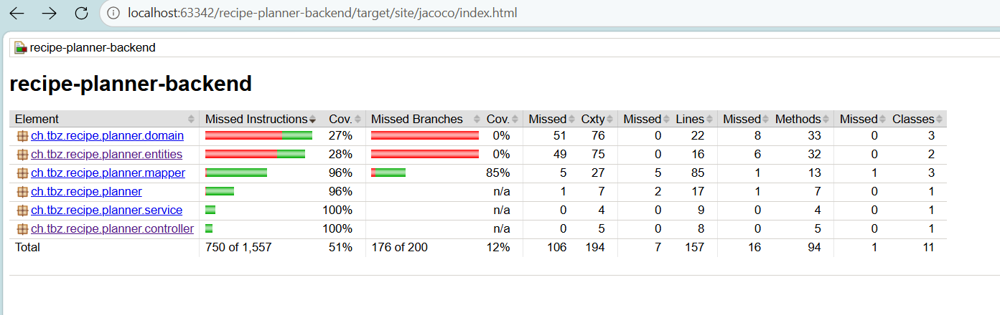
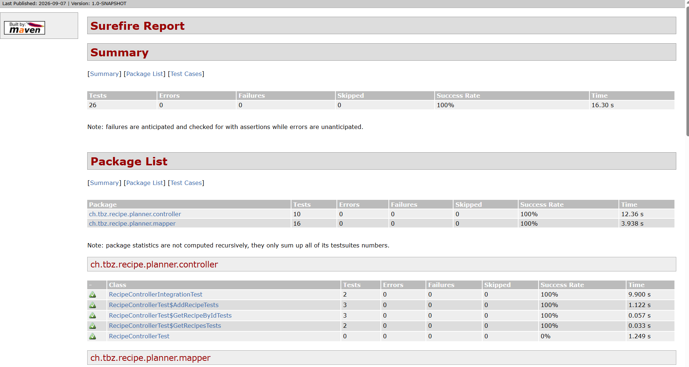
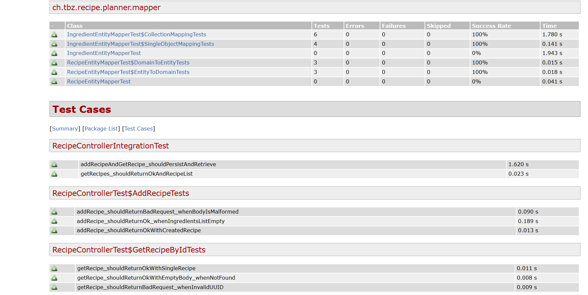
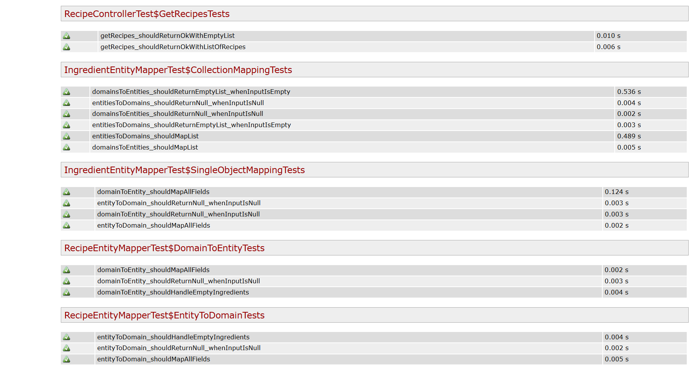

## Aufgabe 1(Unit Testing):
---
**Warum SoftAssertions nutzen?**
Normale Assertions brechen den Test beim ersten Fehler sofort ab. SoftAssertions ignorieren das und prüfen einfach weiter.
**vorteile:**
Test läuft immer komplett durch: Ein Fehler stoppt den Test nicht. Alle nachfolgenden Checks werden trotzdem ausgeführt.
Alle Fehler auf einen Blick: Perfekt für Objekte mit vielen Feldern (z. B. DTOs). Du siehst sofort, was stimmt und was nicht. Das spart dir das nervige "Fehler beheben ➔ Test neu starten ➔ nächster Fehler"-Spielchen.
Gesammelter Fehlerbericht: Am Ende wirft der Test eine übersichtliche Liste mit allen aufgetretenen Fehlern aus.


### Controller Test:
```java
package ch.tbz.recipe.planner.controller;

import ch.tbz.recipe.planner.domain.Ingredient;
import ch.tbz.recipe.planner.domain.Recipe;
import ch.tbz.recipe.planner.domain.Unit;
import ch.tbz.recipe.planner.mapper.RecipeEntityMapper;
import ch.tbz.recipe.planner.repository.RecipeRepository;
import ch.tbz.recipe.planner.service.RecipeService;
import com.fasterxml.jackson.databind.ObjectMapper;
import org.junit.jupiter.api.DisplayName;
import org.junit.jupiter.api.Nested;
import org.junit.jupiter.api.Test;
import org.springframework.beans.factory.annotation.Autowired;
import org.springframework.boot.test.autoconfigure.web.servlet.WebMvcTest;
import org.springframework.boot.test.mock.mockito.MockBean;
import org.springframework.http.MediaType;
import org.springframework.test.web.servlet.MockMvc;

import java.util.Collections;
import java.util.List;
import java.util.UUID;

import static org.hamcrest.Matchers.hasSize;
import static org.hamcrest.Matchers.is;
import static org.mockito.ArgumentMatchers.any;
import static org.mockito.Mockito.times;
import static org.mockito.Mockito.verify;
import static org.mockito.Mockito.when;
import static org.springframework.test.web.servlet.request.MockMvcRequestBuilders.get;
import static org.springframework.test.web.servlet.request.MockMvcRequestBuilders.post;
import static org.springframework.test.web.servlet.result.MockMvcResultMatchers.content;
import static org.springframework.test.web.servlet.result.MockMvcResultMatchers.jsonPath;
import static org.springframework.test.web.servlet.result.MockMvcResultMatchers.status;

@WebMvcTest(RecipeController.class)
class RecipeControllerTest {

    @Autowired
    private MockMvc mockMvc;

    @MockBean
    private RecipeService service;

    @MockBean
    private RecipeEntityMapper mapper;

    @MockBean
    private RecipeRepository recipeRepository;

    @Autowired
    private ObjectMapper objectMapper;

    private Recipe createSampleRecipe() {
        UUID id = UUID.randomUUID();
        Ingredient ingredient = new Ingredient(UUID.randomUUID(), "Tomato", "The big ones", Unit.PIECE, 5);
        return new Recipe(id, "Spaghetti Bolognese", "Classic Italian dish",
                "https://example.com/image.jpg", List.of(ingredient));
    }

    @Nested
    @DisplayName("GET /api/recipes - getRecipes")
    class GetRecipesTests {

        @Test
        @DisplayName("Should return 200 OK and list of recipes")
        void getRecipes_shouldReturnOkWithListOfRecipes() throws Exception {
            Recipe recipe1 = createSampleRecipe();
            Recipe recipe2 = createSampleRecipe();
            when(service.getRecipes()).thenReturn(List.of(recipe1, recipe2));

            mockMvc.perform(get("/api/recipes"))
                    .andExpect(status().isOk())
                    .andExpect(content().contentType(MediaType.APPLICATION_JSON))
                    .andExpect(jsonPath("$", hasSize(2)))
                    .andExpect(jsonPath("$[0].name", is(recipe1.getName())))
                    .andExpect(jsonPath("$[0].ingredients", hasSize(1)))
                    .andExpect(jsonPath("$[1].name", is(recipe2.getName())));

            verify(service, times(1)).getRecipes();
        }

        @Test
        @DisplayName("Should return 200 OK with empty list when no recipes exist")
        void getRecipes_shouldReturnOkWithEmptyList() throws Exception {
            when(service.getRecipes()).thenReturn(Collections.emptyList());

            mockMvc.perform(get("/api/recipes"))
                    .andExpect(status().isOk())
                    .andExpect(content().contentType(MediaType.APPLICATION_JSON))
                    .andExpect(jsonPath("$", hasSize(0)));

            verify(service, times(1)).getRecipes();
        }
    }

    @Nested
    @DisplayName("GET /api/recipes/recipe/{recipeId} - getRecipe")
    class GetRecipeByIdTests {

        @Test
        @DisplayName("Should return 200 OK with recipe when ID exists")
        void getRecipe_shouldReturnOkWithSingleRecipe() throws Exception {
            Recipe recipe = createSampleRecipe();
            when(service.getRecipeById(recipe.getId())).thenReturn(recipe);

            mockMvc.perform(get("/api/recipes/recipe/{recipeId}", recipe.getId()))
                    .andExpect(status().isOk())
                    .andExpect(content().contentType(MediaType.APPLICATION_JSON))
                    .andExpect(jsonPath("$.id", is(recipe.getId().toString())))
                    .andExpect(jsonPath("$.name", is("Spaghetti Bolognese")))
                    .andExpect(jsonPath("$.description", is("Classic Italian dish")))
                    .andExpect(jsonPath("$.imageUrl", is("https://example.com/image.jpg")))
                    .andExpect(jsonPath("$.ingredients[0].name", is("Tomato")))
                    .andExpect(jsonPath("$.ingredients[0].comment", is("The big ones")))
                    .andExpect(jsonPath("$.ingredients[0].unit", is("PIECE")))
                    .andExpect(jsonPath("$.ingredients[0].amount", is(5)));

            verify(service, times(1)).getRecipeById(recipe.getId());
        }

        @Test
        @DisplayName("Should return 200 OK with empty body when recipe is not found")
        void getRecipe_shouldReturnOkWithEmptyBody_whenNotFound() throws Exception {
            UUID unknownId = UUID.randomUUID();
            when(service.getRecipeById(unknownId)).thenReturn(null);

            mockMvc.perform(get("/api/recipes/recipe/{recipeId}", unknownId))
                    .andExpect(status().isOk())
                    .andExpect(content().string(""));

            verify(service, times(1)).getRecipeById(unknownId);
        }

        @Test
        @DisplayName("Should return 400 Bad Request when path variable is not a valid UUID")
        void getRecipe_shouldReturnBadRequest_whenInvalidUUID() throws Exception {
            mockMvc.perform(get("/api/recipes/recipe/{recipeId}", "invalid-uuid-format"))
                    .andExpect(status().isBadRequest());
        }
    }

    @Nested
    @DisplayName("POST /api/recipes - addRecipe")
    class AddRecipeTests {

        @Test
        @DisplayName("Should return 200 OK with created recipe when valid payload is sent")
        void addRecipe_shouldReturnOkWithCreatedRecipe() throws Exception {
            Recipe recipe = createSampleRecipe();
            when(service.addRecipe(any(Recipe.class))).thenReturn(recipe);

            mockMvc.perform(post("/api/recipes")
                            .contentType(MediaType.APPLICATION_JSON)
                            .content(objectMapper.writeValueAsString(recipe)))
                    .andExpect(status().isOk())
                    .andExpect(content().contentType(MediaType.APPLICATION_JSON))
                    .andExpect(jsonPath("$.id", is(recipe.getId().toString())))
                    .andExpect(jsonPath("$.name", is("Spaghetti Bolognese")))
                    .andExpect(jsonPath("$.ingredients", hasSize(1)))
                    .andExpect(jsonPath("$.ingredients[0].name", is("Tomato")));

            verify(service, times(1)).addRecipe(any(Recipe.class));
        }

        @Test
        @DisplayName("Should return 200 OK when recipe has no ingredients")
        void addRecipe_shouldReturnOk_whenIngredientsListEmpty() throws Exception {
            Recipe recipeWithoutIngredients = new Recipe(UUID.randomUUID(), "Simple Bread", "Only flour and water",
                    "https://example.com/bread.jpg", Collections.emptyList());
            when(service.addRecipe(any(Recipe.class))).thenReturn(recipeWithoutIngredients);

            mockMvc.perform(post("/api/recipes")
                            .contentType(MediaType.APPLICATION_JSON)
                            .content(objectMapper.writeValueAsString(recipeWithoutIngredients)))
                    .andExpect(status().isOk())
                    .andExpect(content().contentType(MediaType.APPLICATION_JSON))
                    .andExpect(jsonPath("$.name", is("Simple Bread")))
                    .andExpect(jsonPath("$.ingredients", hasSize(0)));

            verify(service, times(1)).addRecipe(any(Recipe.class));
        }

        @Test
        @DisplayName("Should return 400 Bad Request when request body is malformed JSON")
        void addRecipe_shouldReturnBadRequest_whenBodyIsMalformed() throws Exception {
            mockMvc.perform(post("/api/recipes")
                            .contentType(MediaType.APPLICATION_JSON)
                            .content("{\"name\": invalid_json_here"))
                    .andExpect(status().isBadRequest());
        }
    }
}


```
---

### Mapper test:
#### IngrediesntEntityMapper:
```
package ch.tbz.recipe.planner.mapper;

import ch.tbz.recipe.planner.domain.Ingredient;
import ch.tbz.recipe.planner.domain.Unit;
import ch.tbz.recipe.planner.entities.IngredientEntity;
import org.junit.jupiter.api.DisplayName;
import org.junit.jupiter.api.Nested;
import org.junit.jupiter.api.Test;
import org.springframework.beans.factory.annotation.Autowired;
import org.springframework.boot.test.context.SpringBootTest;

import java.util.Collections;
import java.util.List;
import java.util.UUID;

import static org.assertj.core.api.SoftAssertions.assertSoftly;

@SpringBootTest
class IngredientEntityMapperTest {

    @Autowired
    private IngredientEntityMapper mapper;

    @Nested
    @DisplayName("Single Object Mapping Tests")
    class SingleObjectMappingTests {

        @Test
        @DisplayName("entityToDomain should map all fields correctly")
        void entityToDomain_shouldMapAllFields() {
            UUID id = UUID.randomUUID();
            IngredientEntity entity = new IngredientEntity(id, "Tomato", "The big ones", Unit.GRAMM, 250);

            Ingredient domain = mapper.entityToDomain(entity);

            assertSoftly(softly -> {
                softly.assertThat(domain).as("domain object").isNotNull();
                softly.assertThat(domain.getId()).as("id").isEqualTo(id);
                softly.assertThat(domain.getName()).as("name").isEqualTo("Tomato");
                softly.assertThat(domain.getComment()).as("comment").isEqualTo("The big ones");
                softly.assertThat(domain.getUnit()).as("unit").isEqualTo(Unit.GRAMM);
                softly.assertThat(domain.getAmount()).as("amount").isEqualTo(250);
            });
        }

        @Test
        @DisplayName("entityToDomain should return null when input is null")
        void entityToDomain_shouldReturnNull_whenInputIsNull() {
            Ingredient domain = mapper.entityToDomain(null);

            assertSoftly(softly -> softly.assertThat(domain).as("mapped domain").isNull());
        }

        @Test
        @DisplayName("domainToEntity should map all fields correctly")
        void domainToEntity_shouldMapAllFields() {
            UUID id = UUID.randomUUID();
            Ingredient domain = new Ingredient(id, "Tomato", "The big ones", Unit.GRAMM, 250);

            IngredientEntity entity = mapper.domainToEntity(domain);

            assertSoftly(softly -> {
                softly.assertThat(entity).as("entity object").isNotNull();
                softly.assertThat(entity.getId()).as("id").isEqualTo(id);
                softly.assertThat(entity.getName()).as("name").isEqualTo("Tomato");
                softly.assertThat(entity.getComment()).as("comment").isEqualTo("The big ones");
                softly.assertThat(entity.getUnit()).as("unit").isEqualTo(Unit.GRAMM);
                softly.assertThat(entity.getAmount()).as("amount").isEqualTo(250);
            });
        }

        @Test
        @DisplayName("domainToEntity should return null when input is null")
        void domainToEntity_shouldReturnNull_whenInputIsNull() {
            IngredientEntity entity = mapper.domainToEntity(null);

            assertSoftly(softly -> softly.assertThat(entity).as("mapped entity").isNull());
        }
    }

    @Nested
    @DisplayName("Collection Mapping Tests")
    class CollectionMappingTests {

        @Test
        @DisplayName("entitiesToDomains should map list of entities correctly")
        void entitiesToDomains_shouldMapList() {
            UUID id1 = UUID.randomUUID();
            UUID id2 = UUID.randomUUID();
            List<IngredientEntity> entities = List.of(
                    new IngredientEntity(id1, "Tomato", "Fresh", Unit.PIECE, 3),
                    new IngredientEntity(id2, "Flour", "Whole wheat", Unit.KILOGRAMM, 1)
            );

            List<Ingredient> domains = mapper.entitiesToDomains(entities);

            assertSoftly(softly -> {
                softly.assertThat(domains).as("list").isNotNull();
                softly.assertThat(domains).as("list size").hasSize(2);
                softly.assertThat(domains.get(0).getId()).as("domains[0].id").isEqualTo(id1);
                softly.assertThat(domains.get(0).getName()).as("domains[0].name").isEqualTo("Tomato");
                softly.assertThat(domains.get(0).getComment()).as("domains[0].comment").isEqualTo("Fresh");
                softly.assertThat(domains.get(0).getUnit()).as("domains[0].unit").isEqualTo(Unit.PIECE);
                softly.assertThat(domains.get(0).getAmount()).as("domains[0].amount").isEqualTo(3);

                softly.assertThat(domains.get(1).getId()).as("domains[1].id").isEqualTo(id2);
                softly.assertThat(domains.get(1).getName()).as("domains[1].name").isEqualTo("Flour");
                softly.assertThat(domains.get(1).getComment()).as("domains[1].comment").isEqualTo("Whole wheat");
                softly.assertThat(domains.get(1).getUnit()).as("domains[1].unit").isEqualTo(Unit.KILOGRAMM);
                softly.assertThat(domains.get(1).getAmount()).as("domains[1].amount").isEqualTo(1);
            });
        }

        @Test
        @DisplayName("entitiesToDomains should return empty list when input is empty list")
        void entitiesToDomains_shouldReturnEmptyList_whenInputIsEmpty() {
            List<Ingredient> domains = mapper.entitiesToDomains(Collections.emptyList());

            assertSoftly(softly -> {
                softly.assertThat(domains).as("domains list").isNotNull();
                softly.assertThat(domains).as("domains list").isEmpty();
            });
        }

        @Test
        @DisplayName("entitiesToDomains should return null when input is null")
        void entitiesToDomains_shouldReturnNull_whenInputIsNull() {
            List<Ingredient> domains = mapper.entitiesToDomains(null);

            assertSoftly(softly -> softly.assertThat(domains).as("domains list").isNull());
        }

        @Test
        @DisplayName("domainsToEntities should map list of domains correctly")
        void domainsToEntities_shouldMapList() {
            UUID id1 = UUID.randomUUID();
            UUID id2 = UUID.randomUUID();
            List<Ingredient> domains = List.of(
                    new Ingredient(id1, "Tomato", "Fresh", Unit.PIECE, 3),
                    new Ingredient(id2, "Flour", "Whole wheat", Unit.KILOGRAMM, 1)
            );

            List<IngredientEntity> entities = mapper.domainsToEntities(domains);

            assertSoftly(softly -> {
                softly.assertThat(entities).as("list").isNotNull();
                softly.assertThat(entities).as("list size").hasSize(2);
                softly.assertThat(entities.get(0).getId()).as("entities[0].id").isEqualTo(id1);
                softly.assertThat(entities.get(0).getName()).as("entities[0].name").isEqualTo("Tomato");
                softly.assertThat(entities.get(0).getComment()).as("entities[0].comment").isEqualTo("Fresh");
                softly.assertThat(entities.get(0).getUnit()).as("entities[0].unit").isEqualTo(Unit.PIECE);
                softly.assertThat(entities.get(0).getAmount()).as("entities[0].amount").isEqualTo(3);

                softly.assertThat(entities.get(1).getId()).as("entities[1].id").isEqualTo(id2);
                softly.assertThat(entities.get(1).getName()).as("entities[1].name").isEqualTo("Flour");
                softly.assertThat(entities.get(1).getComment()).as("entities[1].comment").isEqualTo("Whole wheat");
                softly.assertThat(entities.get(1).getUnit()).as("entities[1].unit").isEqualTo(Unit.KILOGRAMM);
                softly.assertThat(entities.get(1).getAmount()).as("entities[1].amount").isEqualTo(1);
            });
        }

        @Test
        @DisplayName("domainsToEntities should return empty list when input is empty list")
        void domainsToEntities_shouldReturnEmptyList_whenInputIsEmpty() {
            List<IngredientEntity> entities = mapper.domainsToEntities(Collections.emptyList());

            assertSoftly(softly -> {
                softly.assertThat(entities).as("entities list").isNotNull();
                softly.assertThat(entities).as("entities list").isEmpty();
            });
        }

        @Test
        @DisplayName("domainsToEntities should return null when input is null")
        void domainsToEntities_shouldReturnNull_whenInputIsNull() {
            List<IngredientEntity> entities = mapper.domainsToEntities(null);

            assertSoftly(softly -> softly.assertThat(entities).as("entities list").isNull());
        }
    }
}

```
#### RecipeEntityMapper:
```java

package ch.tbz.recipe.planner.mapper;

import ch.tbz.recipe.planner.domain.Ingredient;
import ch.tbz.recipe.planner.domain.Unit;
import ch.tbz.recipe.planner.entities.IngredientEntity;
import org.junit.jupiter.api.DisplayName;
import org.junit.jupiter.api.Nested;
import org.junit.jupiter.api.Test;
import org.springframework.beans.factory.annotation.Autowired;
import org.springframework.boot.test.context.SpringBootTest;

import java.util.Collections;
import java.util.List;
import java.util.UUID;

import static org.assertj.core.api.SoftAssertions.assertSoftly;

@SpringBootTest
class IngredientEntityMapperTest {

    @Autowired
    private IngredientEntityMapper mapper;

    @Nested
    @DisplayName("Single Object Mapping Tests")
    class SingleObjectMappingTests {

        @Test
        @DisplayName("entityToDomain should map all fields correctly")
        void entityToDomain_shouldMapAllFields() {
            UUID id = UUID.randomUUID();
            IngredientEntity entity = new IngredientEntity(id, "Tomato", "The big ones", Unit.GRAMM, 250);

            Ingredient domain = mapper.entityToDomain(entity);

            assertSoftly(softly -> {
                softly.assertThat(domain).as("domain object").isNotNull();
                softly.assertThat(domain.getId()).as("id").isEqualTo(id);
                softly.assertThat(domain.getName()).as("name").isEqualTo("Tomato");
                softly.assertThat(domain.getComment()).as("comment").isEqualTo("The big ones");
                softly.assertThat(domain.getUnit()).as("unit").isEqualTo(Unit.GRAMM);
                softly.assertThat(domain.getAmount()).as("amount").isEqualTo(250);
            });
        }

        @Test
        @DisplayName("entityToDomain should return null when input is null")
        void entityToDomain_shouldReturnNull_whenInputIsNull() {
            Ingredient domain = mapper.entityToDomain(null);

            assertSoftly(softly -> softly.assertThat(domain).as("mapped domain").isNull());
        }

        @Test
        @DisplayName("domainToEntity should map all fields correctly")
        void domainToEntity_shouldMapAllFields() {
            UUID id = UUID.randomUUID();
            Ingredient domain = new Ingredient(id, "Tomato", "The big ones", Unit.GRAMM, 250);

            IngredientEntity entity = mapper.domainToEntity(domain);

            assertSoftly(softly -> {
                softly.assertThat(entity).as("entity object").isNotNull();
                softly.assertThat(entity.getId()).as("id").isEqualTo(id);
                softly.assertThat(entity.getName()).as("name").isEqualTo("Tomato");
                softly.assertThat(entity.getComment()).as("comment").isEqualTo("The big ones");
                softly.assertThat(entity.getUnit()).as("unit").isEqualTo(Unit.GRAMM);
                softly.assertThat(entity.getAmount()).as("amount").isEqualTo(250);
            });
        }

        @Test
        @DisplayName("domainToEntity should return null when input is null")
        void domainToEntity_shouldReturnNull_whenInputIsNull() {
            IngredientEntity entity = mapper.domainToEntity(null);

            assertSoftly(softly -> softly.assertThat(entity).as("mapped entity").isNull());
        }
    }

    @Nested
    @DisplayName("Collection Mapping Tests")
    class CollectionMappingTests {

        @Test
        @DisplayName("entitiesToDomains should map list of entities correctly")
        void entitiesToDomains_shouldMapList() {
            UUID id1 = UUID.randomUUID();
            UUID id2 = UUID.randomUUID();
            List<IngredientEntity> entities = List.of(
                    new IngredientEntity(id1, "Tomato", "Fresh", Unit.PIECE, 3),
                    new IngredientEntity(id2, "Flour", "Whole wheat", Unit.KILOGRAMM, 1)
            );

            List<Ingredient> domains = mapper.entitiesToDomains(entities);

            assertSoftly(softly -> {
                softly.assertThat(domains).as("list").isNotNull();
                softly.assertThat(domains).as("list size").hasSize(2);
                softly.assertThat(domains.get(0).getId()).as("domains[0].id").isEqualTo(id1);
                softly.assertThat(domains.get(0).getName()).as("domains[0].name").isEqualTo("Tomato");
                softly.assertThat(domains.get(0).getComment()).as("domains[0].comment").isEqualTo("Fresh");
                softly.assertThat(domains.get(0).getUnit()).as("domains[0].unit").isEqualTo(Unit.PIECE);
                softly.assertThat(domains.get(0).getAmount()).as("domains[0].amount").isEqualTo(3);

                softly.assertThat(domains.get(1).getId()).as("domains[1].id").isEqualTo(id2);
                softly.assertThat(domains.get(1).getName()).as("domains[1].name").isEqualTo("Flour");
                softly.assertThat(domains.get(1).getComment()).as("domains[1].comment").isEqualTo("Whole wheat");
                softly.assertThat(domains.get(1).getUnit()).as("domains[1].unit").isEqualTo(Unit.KILOGRAMM);
                softly.assertThat(domains.get(1).getAmount()).as("domains[1].amount").isEqualTo(1);
            });
        }

        @Test
        @DisplayName("entitiesToDomains should return empty list when input is empty list")
        void entitiesToDomains_shouldReturnEmptyList_whenInputIsEmpty() {
            List<Ingredient> domains = mapper.entitiesToDomains(Collections.emptyList());

            assertSoftly(softly -> {
                softly.assertThat(domains).as("domains list").isNotNull();
                softly.assertThat(domains).as("domains list").isEmpty();
            });
        }

        @Test
        @DisplayName("entitiesToDomains should return null when input is null")
        void entitiesToDomains_shouldReturnNull_whenInputIsNull() {
            List<Ingredient> domains = mapper.entitiesToDomains(null);

            assertSoftly(softly -> softly.assertThat(domains).as("domains list").isNull());
        }

        @Test
        @DisplayName("domainsToEntities should map list of domains correctly")
        void domainsToEntities_shouldMapList() {
            UUID id1 = UUID.randomUUID();
            UUID id2 = UUID.randomUUID();
            List<Ingredient> domains = List.of(
                    new Ingredient(id1, "Tomato", "Fresh", Unit.PIECE, 3),
                    new Ingredient(id2, "Flour", "Whole wheat", Unit.KILOGRAMM, 1)
            );

            List<IngredientEntity> entities = mapper.domainsToEntities(domains);

            assertSoftly(softly -> {
                softly.assertThat(entities).as("list").isNotNull();
                softly.assertThat(entities).as("list size").hasSize(2);
                softly.assertThat(entities.get(0).getId()).as("entities[0].id").isEqualTo(id1);
                softly.assertThat(entities.get(0).getName()).as("entities[0].name").isEqualTo("Tomato");
                softly.assertThat(entities.get(0).getComment()).as("entities[0].comment").isEqualTo("Fresh");
                softly.assertThat(entities.get(0).getUnit()).as("entities[0].unit").isEqualTo(Unit.PIECE);
                softly.assertThat(entities.get(0).getAmount()).as("entities[0].amount").isEqualTo(3);

                softly.assertThat(entities.get(1).getId()).as("entities[1].id").isEqualTo(id2);
                softly.assertThat(entities.get(1).getName()).as("entities[1].name").isEqualTo("Flour");
                softly.assertThat(entities.get(1).getComment()).as("entities[1].comment").isEqualTo("Whole wheat");
                softly.assertThat(entities.get(1).getUnit()).as("entities[1].unit").isEqualTo(Unit.KILOGRAMM);
                softly.assertThat(entities.get(1).getAmount()).as("entities[1].amount").isEqualTo(1);
            });
        }

        @Test
        @DisplayName("domainsToEntities should return empty list when input is empty list")
        void domainsToEntities_shouldReturnEmptyList_whenInputIsEmpty() {
            List<IngredientEntity> entities = mapper.domainsToEntities(Collections.emptyList());

            assertSoftly(softly -> {
                softly.assertThat(entities).as("entities list").isNotNull();
                softly.assertThat(entities).as("entities list").isEmpty();
            });
        }

        @Test
        @DisplayName("domainsToEntities should return null when input is null")
        void domainsToEntities_shouldReturnNull_whenInputIsNull() {
            List<IngredientEntity> entities = mapper.domainsToEntities(null);

            assertSoftly(softly -> softly.assertThat(entities).as("entities list").isNull());
        }
    }
}

```


---
## Aufgabe 2(Reports):







---
## Aufgabe 3(Pipeline):
