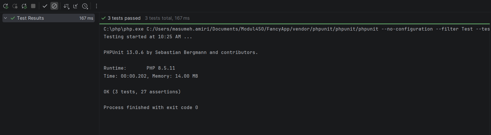

## Aufgabe 1:
```
php -v
composer -v
composer require --dev phpunit/phpunit
# automatisch wird erstellet:
composer.json
composer.lock
vendor/

vendor\bin\phpunit --version

```

---
## Aufgabe2:

### 1. `setUp()`

```php
public function setUp() : void {
    unset($this->_myFancyClass);
    $this->_myFancyClass = new MyFancyClass();
}
```

Diese Methode wird **vor jedem Testfall** ausgeführt.

* Ein eventuell vorhandenes Objekt von `MyFancyClass` wird entfernt.
* Anschliessend wird ein neues `MyFancyClass`-Objekt erstellt.
* Dieses steht danach in `$this->_myFancyClass` für den jeweiligen Test zur Verfügung.

---

### 2. `testShortString()`

Dieser Testfall überprüft die Methode:

```php
$this->_myFancyClass->shortString(...)
```

Dabei werden verschiedene Textlängen und verschiedene Endungen getestet.

| Test                                               | Was wird geprüft?                                                                                                             |
| -------------------------------------------------- | ----------------------------------------------------------------------------------------------------------------------------- |
| `assertEquals('', ...)`                            | Ein leerer Text bleibt leer.                                                                                                  |
| `assertEquals($text35Char, ...)`                   | Ein 35 Zeichen langer Text wird bei einer Grenze von 100 Zeichen nicht gekürzt.                                               |
| `assertEquals('Lorem ... u...', ...)`              | Ein längerer Text wird auf die erwartete Länge gekürzt und mit `...` beendet.                                                 |
| `assertEquals(shortString(130), shortString(591))` | Bei einer Grenze von 100 liefern ein 130- und ein 591-Zeichen-Text dasselbe gekürzte Ergebnis.                                |
| `assertNotEquals(...)`                             | Bei einer Grenze von 200 sollen sich die Ergebnisse der beiden unterschiedlich langen Texte unterscheiden.                    |
| `assertFalse(...)`                                 | Wenn der Text kürzer als die erlaubte Länge ist, aber eine zu lange Endung angegeben wird, soll `false` zurückgegeben werden. |
| `assertStringEndsWith('$', ...)`                   | Das Ergebnis muss mit `$` enden.                                                                                              |
| `assertStringEndsWith('a', ...)`                   | Bei leerer Endung muss das Ergebnis mit `a` enden.                                                                            |
| `assertStringEndsWith('...', ...)`                 | Ein gekürzter Text wird mit `...` beendet.                                                                                    |
| `assertEquals($text35Char, ...)`                   | Ist der Text exakt so lang wie das Limit, darf er nicht verändert werden.                                                     |
| `assertEquals($text130Char, ...)`                  | Dasselbe für einen 130 Zeichen langen Text bei Limit 130.                                                                     |

**Kurz gesagt:**
`testShortString()` überprüft, ob `shortString()` Texte korrekt **kürzt, nicht unnötig kürzt, mit einer bestimmten Endung versieht und bei ungültigen Parametern `false` zurückgibt.**

---

### 3. `testCalcAverage()`

Hier wird die Methode

```php
$this->_myFancyClass->calcAverage(...)
```

getestet.

Es werden drei Arten von Eingaben verwendet:

```php
$emptyValues = [];
$average5 = [4.5,5.0,5.5];
$valuesString = ['4.5','5.0','5.5'];
$valuesWrong = ['3.44','bestanden','nicht bewertbar'];
```

Die Tests prüfen:

```php
assertEquals(0, calcAverage([]))
```

→ Bei einer leeren Liste soll der Durchschnitt `0` sein.

```php
assertEquals(5, calcAverage([4.5, 5.0, 5.5]))
```

→ Der Durchschnitt von 4,5, 5,0 und 5,5 soll `5` ergeben.

```php
assertEquals(calcAverage($average5), calcAverage($valuesString))
```

→ Zahlen als `float` und Zahlen als **Strings** sollen zum gleichen Ergebnis führen.

```php
assertFalse(calcAverage($valuesWrong))
```

→ Enthält die Liste ungültige Werte wie `"bestanden"` oder `"nicht bewertbar"`, soll `false` zurückgegeben werden.

**Kurz gesagt:**
`testCalcAverage()` überprüft die **Berechnung des Durchschnitts sowie den Umgang mit leeren und ungültigen Eingaben**.

---

### 4. `testGetOpposite()`

Hier wird die Methode

```php
$this->_myFancyClass->getOpposite(...)
```

getestet.

Die Methode scheint abhängig vom Datentyp unterschiedliche Aufgaben zu erfüllen. Die Tests zeigen insbesondere, dass sie **Arrays in Strings bzw. Strings in Arrays umwandelt**.

Zum Beispiel:

```php
$this->_myFancyClass->getOpposite([4.5,5.0,5.5])
```

soll ergeben:

```text
4.5,5,5.5
```

Bei einem Array von Strings:

```php
['4.5','5.0','5.5']
```

soll dagegen

```text
4.5,5.0,5.5
```

entstehen.

Bei Strings wird das Trennzeichen getestet:

```php
getOpposite($stringLoremIpsum, ' ')
```

→ Der Text wird anhand von Leerzeichen aufgeteilt. Es werden **15 Elemente** erwartet.

```php
getOpposite($stringLoremIpsum, ', ')
```

→ Aufteilung anhand von `", "`, es werden **3 Elemente** erwartet.

```php
getOpposite($stringLoremIpsum, ',')
```

→ Aufteilung anhand von `","`, es werden **4 Elemente** erwartet.

Ausserdem wird geprüft, ob die Umwandlung **umkehrbar** ist:

```php
getOpposite(getOpposite($stringList))
```

soll wieder den ursprünglichen String ergeben.

Das Gleiche wird mit unterschiedlichen Trennzeichen getestet.

Zum Schluss:

```php
$this->assertFalse(
    $this->_myFancyClass->getOpposite($this->_myFancyClass)
);
```

→ Wird ein ungeeignetes Objekt übergeben, soll die Methode `false` zurückgeben.

**Kurz gesagt:**
`testGetOpposite()` prüft die **Umwandlung zwischen Arrays und Strings**, verschiedene Trennzeichen sowie ungültige Eingaben.

---

### Zusammenfassung

| Testfall            | Getestete Methode | Schwerpunkt               |
| ------------------- | ----------------- | ------------------------- |
| `testShortString()` | `shortString()`   | Texte kürzen und Endungen |
| `testCalcAverage()` | `calcAverage()`   | Durchschnitt berechnen    |
| `testGetOpposite()` | `getOpposite()`   | String ↔ Array umwandeln  |

Die `assert...`-Methoden sind dabei jeweils die **Prüfbedingungen**. Schlägt eine davon fehl, gilt der jeweilige Testfall als fehlgeschlagen.

---
### 3:

