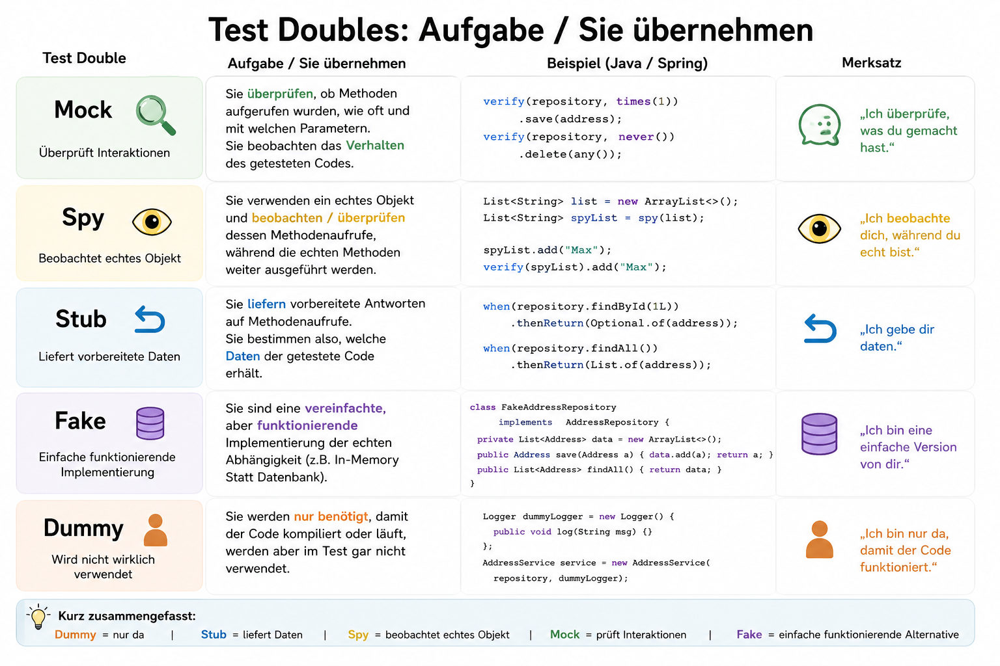
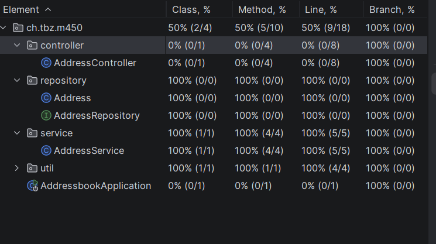
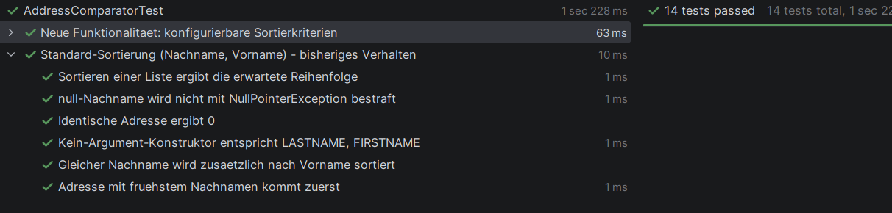

## Ünung1:


### AddressComarator Korrektur:
```java
import ch.tbz.m450.repository.Address;

import java.util.Comparator;

public class AddressComparator implements Comparator<Address> {

    @Override
    public int compare(Address a1, Address a2) {
        return Comparator
                .comparing(Address::getLastname, Comparator.nullsFirst(String::compareToIgnoreCase))
                .thenComparing(Address::getFirstname, Comparator.nullsFirst(String::compareToIgnoreCase))
                .compare(a1, a2);
    }
}
```
### AddressTest

```java
import org.junit.jupiter.api.BeforeEach;
import org.junit.jupiter.api.DisplayName;
import org.junit.jupiter.api.Test;

import java.util.Date;

import static org.junit.jupiter.api.Assertions.*;

class AddressTest {

    private Address address;
    private Date registrationDate;

    @BeforeEach
    void setUp() {
        registrationDate = new Date();
        address = new Address(1, "Max", "Muster", "0791234567", registrationDate);
    }

    @Test
    @DisplayName("AllArgsConstructor setzt alle Felder korrekt")
    void allArgsConstructor_setsAllFields() {
        assertEquals(1, address.getId());
        assertEquals("Max", address.getFirstname());
        assertEquals("Muster", address.getLastname());
        assertEquals("0791234567", address.getPhonenumber());
        assertEquals(registrationDate, address.getRegistrationDate());
    }

    @Test
    @DisplayName("NoArgsConstructor erzeugt ein leeres Objekt ohne Fehler")
    void noArgsConstructor_createsEmptyObject() {
        Address empty = new Address();

        assertEquals(0, empty.getId());
        assertNull(empty.getFirstname());
        assertNull(empty.getLastname());
        assertNull(empty.getPhonenumber());
        assertNull(empty.getRegistrationDate());
    }

    @Test
    @DisplayName("Setter aendern die Werte korrekt (Lombok @Setter)")
    void setters_updateFieldsCorrectly() {
        address.setFirstname("Anna");
        address.setLastname("Beispiel");
        address.setPhonenumber("0791111111");

        assertEquals("Anna", address.getFirstname());
        assertEquals("Beispiel", address.getLastname());
        assertEquals("0791111111", address.getPhonenumber());
    }

    @Test
    @DisplayName("ID kann ueberschrieben werden")
    void setId_updatesId() {
        address.setId(42);
        assertEquals(42, address.getId());
    }
}
```
### AddressComparatorTest
```java
import ch.tbz.m450.repository.Address;
import org.junit.jupiter.api.BeforeEach;
import org.junit.jupiter.api.DisplayName;
import org.junit.jupiter.api.Test;

import java.util.ArrayList;
import java.util.Date;
import java.util.List;

import static org.junit.jupiter.api.Assertions.*;
class AddressComparatorTest {

    private AddressComparator comparator;
    private Address anna;
    private Address bernd;
    private Address annaZweite; // gleicher Nachname wie "anna" -> testet thenComparing

    @BeforeEach
    void setUp() {
        comparator = new AddressComparator();
        anna = new Address(1, "Anna", "Anderegg", "079", new Date());
        bernd = new Address(2, "Bernd", "Berger", "078", new Date());
        annaZweite = new Address(3, "Zoe", "Anderegg", "077", new Date());
    }

    @Test
    @DisplayName("Adresse mit fruehstem Nachnamen kommt zuerst")
    void compare_sortsByLastnameAscending() {
        assertTrue(comparator.compare(anna, bernd) < 0, "Anderegg sollte vor Berger stehen");
        assertTrue(comparator.compare(bernd, anna) > 0, "Berger sollte nach Anderegg stehen");
    }

    @Test
    @DisplayName("Gleicher Nachname wird zusaetzlich nach Vorname sortiert")
    void compare_sameLastname_sortsByFirstname() {
        // anna.lastname == annaZweite.lastname == "Anderegg"
        // firstname: "Anna" vs "Zoe" -> Anna zuerst
        assertTrue(comparator.compare(anna, annaZweite) < 0);
        assertTrue(comparator.compare(annaZweite, anna) > 0);
    }

    @Test
    @DisplayName("Identische Adresse ergibt 0")
    void compare_sameAddress_returnsZero() {
        assertEquals(0, comparator.compare(anna, anna));
    }

    @Test
    @DisplayName("Sortieren einer Liste ergibt die erwartete Reihenfolge")
    void sortList_producesExpectedOrder() {
        List<Address> addresses = new ArrayList<>(List.of(bernd, annaZweite, anna));

        addresses.sort(comparator);

        assertEquals("Anna", addresses.get(0).getFirstname());
        assertEquals("Zoe", addresses.get(1).getFirstname());
        assertEquals("Bernd", addresses.get(2).getFirstname());
    }

    @Test
    @DisplayName("null-Nachname wird nicht mit NullPointerException bestraft")
    void compare_nullLastname_doesNotThrow() {
        Address nullLastname = new Address(4, "Chris", null, "076", new Date());

        assertDoesNotThrow(() -> comparator.compare(nullLastname, anna));
        // nullsFirst -> null gilt als "kleiner"
        assertTrue(comparator.compare(nullLastname, anna) < 0);
    }
}
```
### AdressServiceTest
```java
import ch.tbz.m450.repository.Address;
import ch.tbz.m450.repository.AddressRepository;
import org.junit.jupiter.api.BeforeEach;
import org.junit.jupiter.api.DisplayName;
import org.junit.jupiter.api.Test;
import org.junit.jupiter.api.extension.ExtendWith;
import org.mockito.Mock;
import org.mockito.junit.jupiter.MockitoExtension;

import java.util.Date;
import java.util.List;
import java.util.Optional;

import static org.junit.jupiter.api.Assertions.*;
import static org.mockito.Mockito.*;

@ExtendWith(MockitoExtension.class)
class AddressServiceTest {

    @Mock
    private AddressRepository addressRepository;

    private AddressService addressService;

    private Address anna;
    private Address bernd;

    @BeforeEach
    void setUp() {
        addressService = new AddressService(addressRepository);

        anna = new Address(1, "Anna", "Anderegg", "079", new Date());
        bernd = new Address(2, "Bernd", "Berger", "078", new Date());
    }

    @Test
    @DisplayName("save() delegiert direkt an das Repository und gibt dessen Resultat zurueck")
    void save_delegatesToRepository() {
        when(addressRepository.save(anna)).thenReturn(anna);

        Address result = addressService.save(anna);

        assertEquals(anna, result);
        verify(addressRepository, times(1)).save(anna);
    }

    @Test
    @DisplayName("getAll() sortiert die vom Repository gelieferten Adressen mit AddressComparator")
    void getAll_returnsSortedAddresses() {
        // Repository liefert absichtlich unsortiert (Bernd vor Anna)
        when(addressRepository.findAll()).thenReturn(List.of(bernd, anna));

        List<Address> result = addressService.getAll();

        assertEquals(2, result.size());
        assertEquals("Anderegg", result.get(0).getLastname(), "Anderegg muss vor Berger stehen");
        assertEquals("Berger", result.get(1).getLastname());
        verify(addressRepository, times(1)).findAll();
    }

    @Test
    @DisplayName("getAll() gibt eine leere Liste zurueck, wenn das Repository leer ist")
    void getAll_emptyRepository_returnsEmptyList() {
        when(addressRepository.findAll()).thenReturn(List.of());

        List<Address> result = addressService.getAll();

        assertTrue(result.isEmpty());
    }

    @Test
    @DisplayName("getAddress() gibt Optional.of(address) zurueck, wenn die ID existiert")
    void getAddress_existingId_returnsOptionalWithAddress() {
        when(addressRepository.findById(1)).thenReturn(Optional.of(anna));

        Optional<Address> result = addressService.getAddress(1);

        assertTrue(result.isPresent());
        assertEquals(anna, result.get());
    }

    @Test
    @DisplayName("getAddress() gibt Optional.empty() zurueck, wenn die ID nicht existiert")
    void getAddress_missingId_returnsEmptyOptional() {
        when(addressRepository.findById(999)).thenReturn(Optional.empty());

        Optional<Address> result = addressService.getAddress(999);

        assertTrue(result.isEmpty());
        verify(addressRepository, times(1)).findById(999);
    }
}

```

###AdressController Test:
```java
import ch.tbz.m450.repository.Address;
import ch.tbz.m450.service.AddressService;
import com.fasterxml.jackson.databind.ObjectMapper;
import com.fasterxml.jackson.datatype.jsr310.JavaTimeModule;
import org.junit.jupiter.api.BeforeEach;
import org.junit.jupiter.api.DisplayName;
import org.junit.jupiter.api.Test;
import org.junit.jupiter.api.extension.ExtendWith;
import org.mockito.Mock;
import org.mockito.junit.jupiter.MockitoExtension;
import org.springframework.http.MediaType;
import org.springframework.test.web.servlet.MockMvc;
import org.springframework.test.web.servlet.setup.MockMvcBuilders;

import java.util.Date;
import java.util.List;
import java.util.Optional;

import static org.mockito.Mockito.*;
import static org.springframework.test.web.servlet.request.MockMvcRequestBuilders.*;
import static org.springframework.test.web.servlet.result.MockMvcResultMatchers.*;

@ExtendWith(MockitoExtension.class)
class AddressControllerTest {

    @Mock
    private AddressService addressService;

    private MockMvc mockMvc;
    private ObjectMapper objectMapper;

    private Address anna;

    @BeforeEach
    void setUp() {
        AddressController controller = new AddressController(addressService);
        mockMvc = MockMvcBuilders.standaloneSetup(controller).build();

        objectMapper = new ObjectMapper();
        objectMapper.registerModule(new JavaTimeModule());

        anna = new Address(1, "Anna", "Anderegg", "079", new Date());
    }

    @Test
    @DisplayName("POST /address erstellt eine Adresse und gibt Status 201 zurueck")
    void createAddress_returns201AndCreatedAddress() throws Exception {
        when(addressService.save(any(Address.class))).thenReturn(anna);

        mockMvc.perform(post("/address")
                        .contentType(MediaType.APPLICATION_JSON)
                        .content(objectMapper.writeValueAsString(anna)))
                .andExpect(status().isCreated())
                .andExpect(jsonPath("$.firstname").value("Anna"))
                .andExpect(jsonPath("$.lastname").value("Anderegg"));

        verify(addressService, times(1)).save(any(Address.class));
    }

    @Test
    @DisplayName("GET /address gibt Status 200 und die Liste aller Adressen zurueck")
    void getAddresses_returns200AndList() throws Exception {
        when(addressService.getAll()).thenReturn(List.of(anna));

        mockMvc.perform(get("/address"))
                .andExpect(status().isOk())
                .andExpect(jsonPath("$", org.hamcrest.Matchers.hasSize(1)))
                .andExpect(jsonPath("$[0].firstname").value("Anna"));

        verify(addressService, times(1)).getAll();
    }

    @Test
    @DisplayName("GET /address/{id} gibt Status 200 zurueck, wenn die Adresse existiert")
    void getAddress_existingId_returns200() throws Exception {
        when(addressService.getAddress(1)).thenReturn(Optional.of(anna));

        mockMvc.perform(get("/address/1"))
                .andExpect(status().isOk())
                .andExpect(jsonPath("$.id").value(1))
                .andExpect(jsonPath("$.firstname").value("Anna"));
    }

    @Test
    @DisplayName("GET /address/{id} gibt Status 404 zurueck, wenn die Adresse nicht existiert")
    void getAddress_missingId_returns404() throws Exception {
        when(addressService.getAddress(999)).thenReturn(Optional.empty());

        mockMvc.perform(get("/address/999"))
                .andExpect(status().isNotFound());

        verify(addressService, times(1)).getAddress(999);
    }
}
```
## Übung 2:

### ### AddressComparator:

```java
package ch.tbz.m450.util;

import ch.tbz.m450.repository.Address;

import java.util.Comparator;
import java.util.Date;

/**
 * Vergleicht zwei Address-Objekte.
 *
 * Standardmaessig wird nach Nachname, dann Vorname sortiert (wie bisher) -
 * das bleibt kompatibel zu allen Stellen, die "new AddressComparator()"
 * ohne Argumente aufrufen (z.B. AddressService.getAll()).
 *
 * Zusaetzlich kann man beliebige weitere Attribute als Sortierkriterien
 * angeben, in der gewuenschten Prioritaet - z.B.
 *   new AddressComparator(SortField.ID)
 *   new AddressComparator(SortField.REGISTRATION_DATE, SortField.LASTNAME)
 */
public class AddressComparator implements Comparator<Address> {

    /**
     * Alle Attribute von Address, nach denen sortiert werden kann.
     */
    public enum SortField {
        ID,
        FIRSTNAME,
        LASTNAME,
        PHONENUMBER,
        REGISTRATION_DATE
    }

    private final Comparator<Address> comparator;

    /**
     * Standard-Sortierung: Nachname, dann Vorname (bisheriges Verhalten).
     */
    public AddressComparator() {
        this(SortField.LASTNAME, SortField.FIRSTNAME);
    }

    /**
     * Erlaubt es, ein oder mehrere Sortierkriterien in der gewuenschten
     * Reihenfolge (Prioritaet) zu uebergeben. Das erste Feld ist das
     * Hauptkriterium, jedes weitere wird als Tie-Breaker verwendet
     * (via thenComparing), falls die vorherigen Felder gleich sind.
     *
     * @param fields mindestens ein SortField
     */
    public AddressComparator(SortField... fields) {
        if (fields == null || fields.length == 0) {
            throw new IllegalArgumentException("Es muss mindestens ein SortField angegeben werden");
        }

        Comparator<Address> result = toComparator(fields[0]);
        for (int i = 1; i < fields.length; i++) {
            result = result.thenComparing(toComparator(fields[i]));
        }
        this.comparator = result;
    }

    /**
     * Wandelt ein einzelnes SortField in den passenden Feld-Comparator um.
     * nullsFirst() verhindert NullPointerExceptions, falls ein Attribut
     * (z.B. phonenumber oder registrationDate) mal nicht gesetzt ist.
     */
    private Comparator<Address> toComparator(SortField field) {
        return switch (field) {
            case ID -> Comparator.comparingInt(Address::getId);
            case FIRSTNAME -> Comparator.comparing(
                    Address::getFirstname, Comparator.nullsFirst(String::compareToIgnoreCase));
            case LASTNAME -> Comparator.comparing(
                    Address::getLastname, Comparator.nullsFirst(String::compareToIgnoreCase));
            case PHONENUMBER -> Comparator.comparing(
                    Address::getPhonenumber, Comparator.nullsFirst(String::compareToIgnoreCase));
            case REGISTRATION_DATE -> Comparator.comparing(
                    Address::getRegistrationDate, Comparator.nullsFirst(Date::compareTo));
        };
    }

    @Override
    public int compare(Address a1, Address a2) {
        return comparator.compare(a1, a2);
    }
}
```
### AddressComparator Test:

```java
package ch.tbz.m450.util;

import ch.tbz.m450.repository.Address;
import org.junit.jupiter.api.BeforeEach;
import org.junit.jupiter.api.DisplayName;
import org.junit.jupiter.api.Nested;
import org.junit.jupiter.api.Test;

import java.time.LocalDate;
import java.time.ZoneId;
import java.util.ArrayList;
import java.util.Date;
import java.util.List;

import static org.junit.jupiter.api.Assertions.*;

/**
 * Testet die Sortierlogik des AddressComparator isoliert - ohne Service,
 * ohne Repository, ohne Spring-Kontext. Das ist ein reiner Unit-Test.
 */
class AddressComparatorTest {

    private AddressComparator comparator;
    private Address anna;
    private Address bernd;
    private Address annaZweite; // gleicher Nachname wie "anna" -> testet thenComparing

    private static Date date(int year, int month, int day) {
        return Date.from(LocalDate.of(year, month, day).atStartOfDay(ZoneId.systemDefault()).toInstant());
    }

    @BeforeEach
    void setUp() {
        comparator = new AddressComparator();
        anna = new Address(1, "Anna", "Anderegg", "079", date(2020, 5, 1));
        bernd = new Address(2, "Bernd", "Berger", "078", date(2019, 3, 15));
        annaZweite = new Address(3, "Zoe", "Anderegg", "077", date(2021, 1, 10));
    }

    @Nested
    @DisplayName("Standard-Sortierung (Nachname, Vorname) - bisheriges Verhalten")
    class DefaultSorting {

        @Test
        @DisplayName("Adresse mit fruehstem Nachnamen kommt zuerst")
        void compare_sortsByLastnameAscending() {
            assertTrue(comparator.compare(anna, bernd) < 0, "Anderegg sollte vor Berger stehen");
            assertTrue(comparator.compare(bernd, anna) > 0, "Berger sollte nach Anderegg stehen");
        }

        @Test
        @DisplayName("Gleicher Nachname wird zusaetzlich nach Vorname sortiert")
        void compare_sameLastname_sortsByFirstname() {
            assertTrue(comparator.compare(anna, annaZweite) < 0);
            assertTrue(comparator.compare(annaZweite, anna) > 0);
        }

        @Test
        @DisplayName("Identische Adresse ergibt 0")
        void compare_sameAddress_returnsZero() {
            assertEquals(0, comparator.compare(anna, anna));
        }

        @Test
        @DisplayName("Sortieren einer Liste ergibt die erwartete Reihenfolge")
        void sortList_producesExpectedOrder() {
            List<Address> addresses = new ArrayList<>(List.of(bernd, annaZweite, anna));

            addresses.sort(comparator);

            assertEquals("Anna", addresses.get(0).getFirstname());
            assertEquals("Zoe", addresses.get(1).getFirstname());
            assertEquals("Bernd", addresses.get(2).getFirstname());
        }

        @Test
        @DisplayName("null-Nachname wird nicht mit NullPointerException bestraft")
        void compare_nullLastname_doesNotThrow() {
            Address nullLastname = new Address(4, "Chris", null, "076", date(2020, 1, 1));

            assertDoesNotThrow(() -> comparator.compare(nullLastname, anna));
            assertTrue(comparator.compare(nullLastname, anna) < 0);
        }

        @Test
        @DisplayName("Kein-Argument-Konstruktor entspricht LASTNAME, FIRSTNAME")
        void noArgsConstructor_matchesExplicitLastnameFirstname() {
            AddressComparator explicit = new AddressComparator(
                    AddressComparator.SortField.LASTNAME, AddressComparator.SortField.FIRSTNAME);

            assertEquals(explicit.compare(anna, bernd), comparator.compare(anna, bernd));
            assertEquals(explicit.compare(anna, annaZweite), comparator.compare(anna, annaZweite));
        }
    }

    @Nested
    @DisplayName("Neue Funktionalitaet: konfigurierbare Sortierkriterien")
    class ConfigurableSorting {

        @Test
        @DisplayName("Sortierung nach ID")
        void compare_byId_sortsAscending() {
            AddressComparator byId = new AddressComparator(AddressComparator.SortField.ID);

            assertTrue(byId.compare(anna, bernd) < 0, "ID 1 sollte vor ID 2 stehen");
            assertTrue(byId.compare(annaZweite, anna) > 0, "ID 3 sollte nach ID 1 stehen");
        }

        @Test
        @DisplayName("Sortierung nach Telefonnummer")
        void compare_byPhonenumber_sortsAscending() {
            AddressComparator byPhone = new AddressComparator(AddressComparator.SortField.PHONENUMBER);

            // "077" < "078" < "079"
            assertTrue(byPhone.compare(annaZweite, bernd) < 0);
            assertTrue(byPhone.compare(bernd, anna) < 0);
        }

        @Test
        @DisplayName("Sortierung nach Registrierungsdatum")
        void compare_byRegistrationDate_sortsAscending() {
            AddressComparator byDate = new AddressComparator(AddressComparator.SortField.REGISTRATION_DATE);

            // bernd (2019) < anna (2020) < annaZweite (2021)
            assertTrue(byDate.compare(bernd, anna) < 0);
            assertTrue(byDate.compare(anna, annaZweite) < 0);
            assertTrue(byDate.compare(annaZweite, bernd) > 0);
        }

        @Test
        @DisplayName("Mehrere Kriterien: Vorname zuerst, dann Nachname als Tie-Breaker")
        void compare_multipleFields_appliesInGivenPriority() {
            Address annaAnderegg = new Address(5, "Anna", "Anderegg", "079", date(2020, 5, 1));
            Address annaZimmermann = new Address(6, "Anna", "Zimmermann", "070", date(2020, 5, 1));

            AddressComparator byFirstThenLast = new AddressComparator(
                    AddressComparator.SortField.FIRSTNAME, AddressComparator.SortField.LASTNAME);

            // Gleicher Vorname "Anna" -> Nachname entscheidet: Anderegg vor Zimmermann
            assertTrue(byFirstThenLast.compare(annaAnderegg, annaZimmermann) < 0);
            // Gegenueber "Bernd" gewinnt "Anna" bereits beim ersten Kriterium
            assertTrue(byFirstThenLast.compare(annaAnderegg, bernd) < 0);
        }

        @Test
        @DisplayName("Sortieren einer Liste nach Registrierungsdatum ergibt chronologische Reihenfolge")
        void sortList_byRegistrationDate_producesChronologicalOrder() {
            AddressComparator byDate = new AddressComparator(AddressComparator.SortField.REGISTRATION_DATE);
            List<Address> addresses = new ArrayList<>(List.of(annaZweite, anna, bernd));

            addresses.sort(byDate);

            assertEquals(bernd, addresses.get(0));      // 2019
            assertEquals(anna, addresses.get(1));        // 2020
            assertEquals(annaZweite, addresses.get(2));  // 2021
        }

        @Test
        @DisplayName("null-Telefonnummer wird bei PHONENUMBER-Sortierung toleriert (nullsFirst)")
        void compare_byPhonenumber_nullValue_doesNotThrow() {
            Address noPhone = new Address(7, "Chris", "Ohneton", null, date(2020, 1, 1));
            AddressComparator byPhone = new AddressComparator(AddressComparator.SortField.PHONENUMBER);

            assertDoesNotThrow(() -> byPhone.compare(noPhone, anna));
            assertTrue(byPhone.compare(noPhone, anna) < 0);
        }

        @Test
        @DisplayName("null-Registrierungsdatum wird toleriert (nullsFirst)")
        void compare_byRegistrationDate_nullValue_doesNotThrow() {
            Address noDate = new Address(8, "Chris", "Ohnedatum", "075", null);
            AddressComparator byDate = new AddressComparator(AddressComparator.SortField.REGISTRATION_DATE);

            assertDoesNotThrow(() -> byDate.compare(noDate, anna));
            assertTrue(byDate.compare(noDate, anna) < 0);
        }

        @Test
        @DisplayName("Leere SortField-Liste wirft IllegalArgumentException")
        void constructor_noFields_throwsIllegalArgumentException() {
            AddressComparator.SortField[] emptyFields = {};

            assertThrows(IllegalArgumentException.class, () -> new AddressComparator(emptyFields));
        }
    }
}

```


