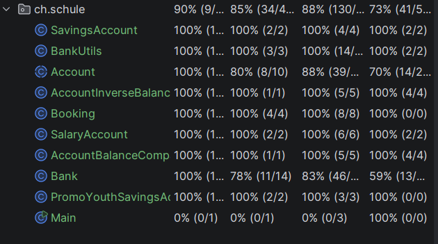

# Testlevels

## Allgemeine Begriffe

- Level:
  - verschiedene Stufen im Software Entwicklungsprozess
- Testarten:
  - Unit Testing / Component Testing
  - Integration Testing
  - System Testing
  - Acceptance Testing

- White-Box-Test
  - Die Tests werden mit Kenntnissen über die innere Funktionsweise des zu testenden Systems entwickelt werden
- Black-Box-Test
  - Tests werden ohne Kenntnisse über die innere Funktionsweise des zu testenden Systems entwickelt


## Testarten

### Unit Tests

Merkmale:
- Gehört zu ersten Level von Testing
- White-Box-Test
- Komponente werden einzeln und isoliert getestet
- Vom Entwickler geschrieben


### Component Testing

Mermale:
- White-Box-Test
- Gehört manchmal zum Unit Testing dazu
- Vom Entwickler geschrieben
- Zusammenspiel zwischen mehreren Komponenten getestet
  - Schnittstelle zu DB wird gemockt


### Integration Testing

Merkmale:
- Black-Box und White-Box-Test
- Integration (zB zu DB) aktiv benutzt
  - zB: Zugriff auf DB testen


### System Testing

Merkmale:
- Vom selben Team wie Integration Tests getestet
- Black-Box-Test
- Software als ganzes wird getestet
- Funktional und Nichtfunktional wird getestet

### Acceptance Testing:

Merkmale:
- Vom Business/Kunde getestet
- Black-Box-Testing
- Erfüllt das System die Akzeptanz Kriterien


## Aufgaben Teil 1

### Aufgabe 1

Test Levels:
- Unit Test
- System Test

Wann:
- Unit Testing:
  - So oft wie möglich
    - z. B. jedes Mal wenn ein Code gepusht wird (CI/CD)
- System Testing:
  - Erst wenn ganzes System zusammenspielt
  - z.B am Ende eines Sprints
- => Code Reviews


Wer:
- Eigentlich alle bei der Code Review
- Keine dedizierte Testing oder QA Teams
- Jede Person schaut, ob Unit Tests oder End-2-End Tests fehlerfrei laufen, bevor sie Pull Request erstellen

### Aufgabe 2

Testing approach
- Wie viel und wo testet man?
- Wie organisiert man das Testen?

Testing levels
- Verschiedene Stufen der Entwicklung
- Wann und wo im Entwicklungsprozess (V-Model) wird getestet

Testing types, techniques and tactics
- Types:
  - Was wird geprüft
    - Funktional, nicht funktional
- Techniques:
  - Black oder White-Box-Testing?
- Tactics:
  - Welche Reihenfolge, was wird priorisiert? 
  - Testing-Entscheidungen


## Aufgaben Teil 2

### Aufgabe 1

[Calculator](../Projekte-Code/untitled/src/main/Unit/Calculator.java)

````java
package Unit;

public class Calculator {

    public double add(double summand1, double summand2) {
        return summand1 + summand2;
    }

    public double subtract(double minuend, double subtrahend) {
        return minuend - subtrahend;
    }

    public double multiply(double factor1, double factor2) {
        return factor1 * factor2;
    }

    public double divide(double dividend, double divisor) {
        if (divisor == 0) {
            throw new IllegalArgumentException("Division durch 0 ist nicht erlaubt");
        }
        return dividend / divisor;
    }
}
````

[Calculator Test](../Projekte-Code/untitled/src/test/CalculatorTest.java)

````java

import Unit.Calculator;
import org.junit.jupiter.api.BeforeEach;
import org.junit.jupiter.api.DisplayName;
import org.junit.jupiter.api.Test;

import static org.junit.jupiter.api.Assertions.assertEquals;
import static org.junit.jupiter.api.Assertions.assertThrows;

class CalculatorTest {

    private Calculator calculator;

    @BeforeEach
    void setUp() {
        calculator = new Calculator();
    }


    /* Addition */

    @Test
    @DisplayName("Addition zweier positiver Zahlen")
    void add_zweiPositiveZahlen() {
        assertEquals(8.0, calculator.add(5.0, 3.0));
    }

    @Test
    @DisplayName("Addition mit negativer Zahl")
    void add_mitNegativerZahl() {
        assertEquals(2.0, calculator.add(5.0, -3.0));
    }

    @Test
    @DisplayName("Addition mit Null")
    void add_mitNull() {
        assertEquals(5.0, calculator.add(5.0, 0.0));
    }

    /* Subtraktion */

    @Test
    @DisplayName("Subtraktion zweier positiver Zahlen")
    void subtract_zweiPositiveZahlen() {
        assertEquals(2.0, calculator.subtract(5.0, 3.0));
    }

    @Test
    @DisplayName("Subtraktion, die ein negatives Ergebnis liefert")
    void subtract_negativesErgebnis() {
        assertEquals(-2.0, calculator.subtract(3.0, 5.0));
    }

    /* Multiplikation */

    @Test
    @DisplayName("Multiplikation zweier positiver Zahlen")
    void multiply_zweiPositiveZahlen() {
        assertEquals(15.0, calculator.multiply(5.0, 3.0));
    }

    @Test
    @DisplayName("Multiplikation mit Null")
    void multiply_mitNull() {
        assertEquals(0.0, calculator.multiply(5.0, 0.0));
    }

    @Test
    @DisplayName("Multiplikation zweier negativer Zahlen ergibt positiv")
    void multiply_zweiNegativeZahlen() {
        assertEquals(15.0, calculator.multiply(-5.0, -3.0));
    }

    /* Division */

    @Test
    @DisplayName("Division zweier positiver Zahlen")
    void divide_zweiPositiveZahlen() {
        assertEquals(2.5, calculator.divide(5.0, 2.0));
    }

    @Test
    @DisplayName("Division durch Null wirft Exception")
    void divide_durchNull_wirftException() {
        assertThrows(IllegalArgumentException.class, () -> calculator.divide(5.0, 0.0));
    }

    @Test
    @DisplayName("Division mit negativem Divisor")
    void divide_negativerDivisor() {
        assertEquals(-2.5, calculator.divide(5.0, -2.0));
    }
}

````


### Aufgabe 2


#### JUnit Features

- @Test
  - Markiert Methode als Test
- @BeforeEach/AfterEach
  - Wird vor/nach jedem Test ausgeführt
  - Zum Beispiel:
    - Test-DB reset
- @BeforeAll/@AfterAll
  - Wird vor/nach allen Tests ausgeführt
  - Beispiele:
    - DB-Verbindung aufbauen
    - Grosse Testdaten Laden
- @DisplayName
  - Definiert Namen des Tests
- @RepeatedTest
  - Wiederholender Test
  - Beispiele:
    - Stabilität testen


[Nützliche Seite](https://www.softwaretestinghelp.com/junit-annotations-tutorial/)


### Aufgabe 3

#### Überblick

Was ist es?
- Applikation, zur Verwaltung von Bankkonten 
  - Sparkonte, Jugend-Promo-Sparkonto, Lohnkonto

Zentrale Klassen:
- Bank, Account, Booking, BankUtils


#### Zusammenhänge

- Vererbung
  - SavingsAccount und SalaryAccount erben von Account
  - PromoYouthSavingsAccount erbt von SavingsAccount

- Aggregation
  - Bank 1 → 0..* Account
    - Eine Bank verwaltet mehrere Konten
  - Account 1 → 0..* Booking
    - Ein Konto hat mehrere Buchungen


#### Ablauf einer Transaktion

1. Bank.deposit(id, date, amount) wird aufgerufen
2. Bank sucht Konto über TreeMap.get(id)
3. Falls kein Konto gefunden → false
4. Sonst: Aufruf account.deposit(date, amount)
5. Rückgabewert (true/false) wird bis zum Aufrufer durchgereicht


#### Ablauf einer Abhebung

1. Bank.withdraw(id, date, amount) sucht Konto
2. Delegation an account.withdraw(date, amount)
   - Regeln: 
     - SavingsAccount/PromoYouthSavingsAccount: nur falls balance >= amount
     - SalaryAccount: nur falls balance - amount >= creditLimit
3. Bei Erfolg: super.withdraw() aus Account bucht negativen Betrag und aktualisiert balance


### Aufgabe 4





